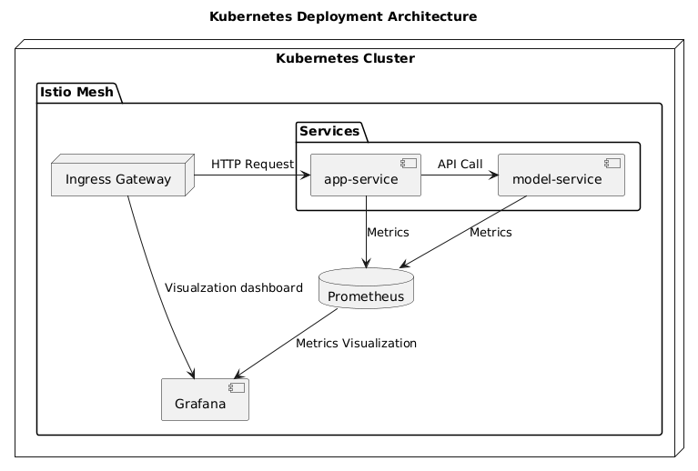
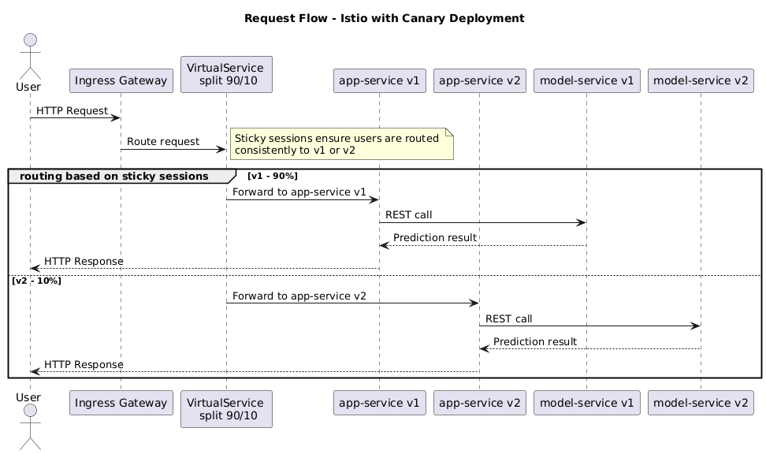
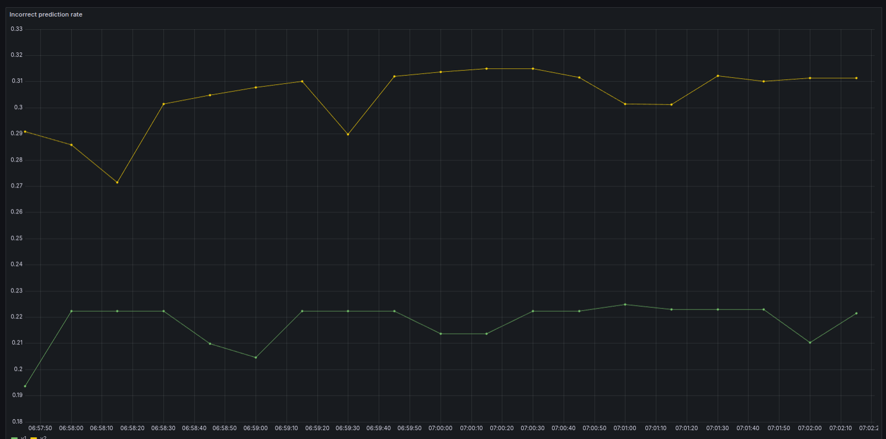

# Restaurant Sentiment Analysis – MLOps & Kubernetes Deployment

This repository contains the end-to-end MLOps pipeline and Kubernetes deployment architecture for a Restaurant Sentiment Analysis web application.

The project demonstrates a production-grade Release Engineering setup, featuring **automated provisioning** (Ansible/Vagrant), **container orchestration** (Kubernetes/Helm), **service mesh traffic management** (Istio), and **continuous experimentation** (A/B testing).

---

## 🚀 Key Features & Tech Stack

* **Infrastructure:** Kubernetes, Docker, Vagrant, Ansible, Minikube/VirtualBox.
* **MLOps & Data:** DVC (Data Version Control), Scikit-learn, Joblib.
* **CI/CD & Deployment:** Helm Charts, GitHub Actions, Istio (Canary & Shadow deployments).
* **Observability:** Prometheus, Grafana, Kiali.
* **Testing:** Pytest (Data invariants, model performance verification, determinism checks).

---

## 🏗 System Architecture

The system follows a microservice architecture deployed on a Kubernetes cluster.

### Services
* **App Service:** Frontend and API gateway that handles user requests.
* **Model Service:** Microservice exposing the trained sentiment analysis model via REST API.
* **Monitoring Stack:** Prometheus for metrics collection and Grafana for visualization.
* **Istio Service Mesh:** Manages internal traffic routing, sticky sessions, and ingress.

### Cluster Diagram
The following diagram illustrates the deployment of services within the Kubernetes cluster and the Istio mesh integration:



---
## 🧩 Microservices & Component Ecosystem

The system follows a strictly decoupled architecture to ensure reproducibility and scalability. The logic is distributed across the following repositories:

| Component | Repository | Role & MLOps Significance |
| :--- | :--- | :--- |
| **Model Training** | [model-training](https://github.com/remla25-team22/model-training) | **DVC Pipeline.** Manages data versioning, model training, and evaluation. Ensures experiment reproducibility. |
| **Model Service** | [model-service](https://github.com/remla25-team22/model-service) | **Inference Engine.** Wraps the trained model in a REST API for production serving. Supports canary releases. |
| **Shared Preprocessing** | [lib-ml](https://github.com/remla25-team22/lib-ml) | **Skew Prevention.** A versioned Python library containing preprocessing logic used by *both* training and inference to prevent **training-serving skew**. |
| **App Service** | [app-service](https://github.com/remla25-team22/app-service) | **API Gateway.** Backend service that handles routing, user sessions, and forwards requests to the model. |
| **App Frontend** | [app-frontend](https://github.com/remla25-team22/app-frontend) | **User Interface.** Web interface for users to submit reviews and view sentiment predictions. |
| **Version Utility** | [lib-version](https://github.com/remla25-team22/lib-version) | **Observability.** Utility library ensuring accurate version tracking and logging across distributed services. |

---
## 🚦 Traffic Management & Deployment Strategies

This project utilizes **Istio** to handle advanced deployment strategies, moving beyond simple rolling updates.

### Canary Deployments & Sticky Sessions
To ensure stability when introducing new model versions, we implemented a **Canary Release** strategy:
1.  **Ingress Gateway:** Receives external HTTP requests.
2.  **VirtualService:** Splits traffic 90% to `v1` (Stable) and 10% to `v2` (Experimental/Candidate).
3.  **DestinationRule:** Ensures sticky sessions (via headers/cookies) so users experience consistent model behavior during their session.



### Shadow Launching
In addition to canary releases, the system supports **Shadow Launching**. Traffic is mirrored to a new version of the model service (`v2`) without returning the response to the user. This allows for load testing and error rate verification on production traffic without impacting the user experience.

---

## 🧪 MLOps Pipeline & Automated Testing

The machine learning lifecycle is managed via `lib-ml` and `model-training`, ensuring reproducibility and strict quality gates.

### 1. Configuration Management (DVC)
The pipeline is defined in `dvc.yaml`, allowing full reproducibility via `dvc repro`.
* **Data Prep:** Cleans text and handles remote dataset retrieval.
* **Training:** Serializes the model using `joblib`.
* **Evaluation:** Tracks metrics (`metrics.json`) to compare experiments.

### 2. Quality Assurance Suites
We implement a rigorous testing suite (`pytest`) to prevent model degradation:
* **Feature Integrity:** Verifies vectorizer vocabulary and dataset schema.
* **Model Performance:** Ensures the model beats a majority-class baseline and maintains >70% accuracy on negation handling.
* **Determinism:** Runs training with different seeds to prove stability.
* **Inference Constraints:** Verifies memory usage stays under 500MB during inference.

---

## 📊 Continuous Experimentation

We validated the hypothesis that *reducing vectorizer dimensionality from 1000 to 100 features would not significantly degrade prediction accuracy*.

### Design
* **Baseline (v1):** Full feature set.
* **Experimental (v2):** Reduced feature set.
* **Feedback Loop:** User feedback on predictions is scraped by Prometheus.

### Results
The dashboard below tracks the `incorrect_prediction_rate` for both versions in real-time.



**Decision Rule:** The experimental version (`v2`) is accepted only if the error rate does not exceed the baseline by more than 2% after 5,000 predictions.

---

## 💻 Getting Started

### Local Development (Docker Compose)
For a quick local test without the full Kubernetes cluster:

1.  Clone the repository.
2.  Run `docker compose up`.
3.  Navigate to [http://localhost:8080/index.html](http://localhost:8080/index.html).
4.  Input a review to see the sentiment prediction.

### Full Kubernetes Cluster Provisioning
The `provisioning/` directory contains the IaC (Infrastructure as Code) to spin up a 3-node cluster (1 Controller, 2 Workers).

**Prerequisites:** VirtualBox, Vagrant, Ansible.

1.  **Provision Infrastructure:**
    ```bash
    cd provisioning
    vagrant up --provision
    ```
2.  **Finalize Cluster Setup:**
    ```bash
    ansible-playbook -i inventory.cfg playbooks/finalization.yml --limit ctrl
    ```
    *This installs MetalLB, NGINX Ingress, Istio, Prometheus, and Grafana.*

3.  **Deploy Application (Helm):**
    ```bash
    helm upgrade --install my-app ../app -f ../app/values-canary.yaml
    ```

### Accessing Services
* **App Frontend:** `https://app.local/index.html`
* **Grafana:** `https://grafana.local` (Default creds: `admin`/`admin`)
* **Prometheus:** `https://prometheus.local`

*(Note: Ensure your `/etc/hosts` file maps the cluster IP `192.168.56.91` to the domains listed above).*

---

## 📂 Repository Structure

* `app/`: Helm charts for Kubernetes deployment.
* `provisioning/`: Vagrantfiles and Ansible playbooks for cluster creation.
* `istio/`: VirtualServices, Gateways, and DestinationRules configuration.
* `model-training/`: DVC pipeline, training scripts, and unit tests.
* `docker-compose.yml`: Local development orchestration.
